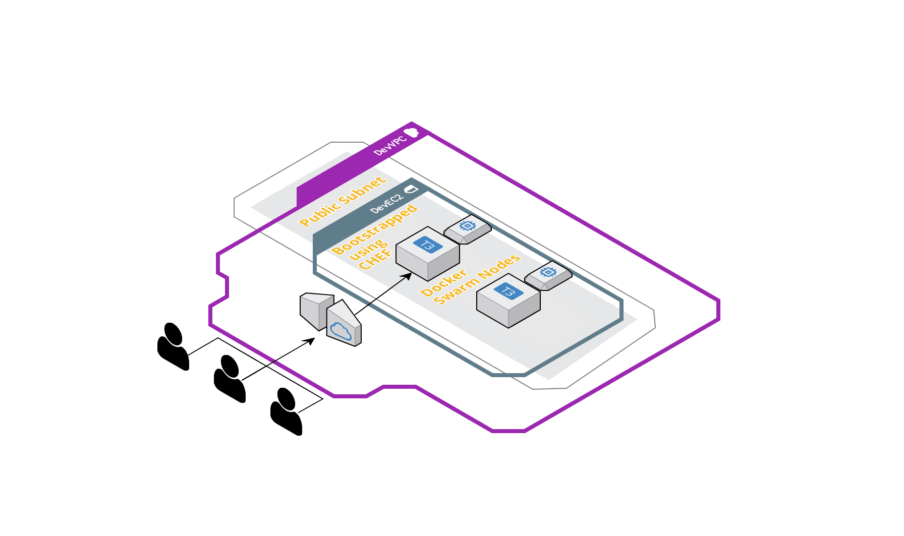

# A REST API for Microsoft Excel: Deployed to a Docker Swarm on AWS  

In this article we will go through a Python-Flask application implementing a REST api for an excel file. This app will enable API endpoints to perform basic CRUD operations on an excel file, which is generally not API enabled. I will  also describe a way to deploy the app in a Docker swarm, hosted on AWS. One thing to note here is that when I deploy this app to Docker, I am not using uWSGI. So this is not recommended option for Production. For production, uWSGI should be used along with a reverse proxy like nginx to have a proper API deployment setup. I will cover the uWSGI-Nginx architecture in a separate post.Below are the technical components used by the app architecture:  
 - Application:  
    - Python
    - Flask
    - Pandas framework  
 - Infrastructure:  
    - AWS  
    - Cloudformation  
 - Configuration Management: CHEF  
 - Deployment:  
    - Docker  
    - Docker Swarm   

The sections below describe different aspects of the app, API and deployment related details.

## About the application  
The application is built on python and the API endpoints have been implemented using Flask as the framework. The full code can be found on Github:  
https://github.com/amlana21/excel-api-python  

The code is still missing some key features and functionalities to enhance the API functions. I am working on improving the functionalities. Some key features which are WIP:  
 - Use a local DB instead of files for temp table storage  
 - Merge back the file after final updates
 - Authentication  
 - Better exception handling
 - More API endpoints  

Below are some key API endpoints and their functionalities supported by the App:  
 - ```/initiate```: This is the first API which should be called before performing anything. This reads the input file and creates temporary schema/table files for further operations. Each worksheet in the input excel will be treated as a single table.  
 - ```/query/\<tablename\>```: This will query the table(worksheet) name passed and return back all rows and columns  
 - ```/query/\<tablename\>?col1=value1&col2=value2```: This will query the table(worksheet) name passed, based on the URL parameters passed and will return results. col1,col2 are the column names of the excel sheet.  
 - ```/create/\<tablename\>```: This will add rows to the table(worksheet) name passed. The vlues for the rows are passed in the POST body of the request. Based on whether single row is added or multiple rows, the body input will differ:  
 ```
 Multi rows: 
 [{
	"col1":11234,
	"col2":"New Two"
}]

Single Row:
{
	"col1":12589,
	"col2":"New Three"
}  
```
 - ```/updatebyid/\<tablename\>```: This will update the table(worksheet) name passed. The row will be identified by an id passed in the body. The id can be found from the generated temp table files. This will be a PATCH request with the below sample body format:  

 ``` 
 {
	"id":11,
	"col1":3300
}
```  
 - ```/updatecondition/\<tablename\>?col1=abc3&col2=val2```: This will update the table(worksheet) name passed. The row will be identified by the URL parameters passed. The columns to be updated are passed in the body for the PATCH request.  
 ``` 
 {
	"col1":"val1",
	"col2":3300
}
```  
 - ```/deletebyid/\<tablename\>?id=4```: This will delete rows from the table(worksheet) name passed and identified by the id passed to the URL parameters.This will be a DELETE request.  
 - ```/deletebyfields/\<tablename\>```: This will delete rows from the table(worksheet) name passed and identified by the columns passed in the DELETE body.  
 ``` 
 {
	"col1":"abc3",
	"col2":"val2"
}
```  

These endpoints can be invoked using CURL or from applications like Postman, and passing required parameters.These can also be incorporated in any custome developed application by invoking the REST API endpoints. 

## Infrastructure  
The infrastructure for the Flask app is housed in AWS. I am using a cloudformation template to launch different components of the architecture like VPC, Subnets etc. Below is an overview of the architecture which is built using the Cloudformation template:  

  

The Cloudformation template can be found in the Deploy folder of the code base. The temaplte can be used to launch a Cloudformation stack from the AWS console.The stack will contain the EC2 instances which will be used to initiate the Docker swarm.  

## Configuration Management  
Once the instances are launched, required packages and modules need to be installed on the instances so the app can be deployed. We will need the below packages/modules for our app deployment:  
 - Docker  
 - Docker Compose  
 - GIT  

This is achieved using a CHEF cookbook consisting of the recipes needed for the installations.The CHEF repo can be found in the Deploy folder of the code base.To execute the CHEF recipes, below are some pre-requisites:  
 - A workstation with CHEF installed, to run the CHEF commands  
 - A CHEF manage server. The free version of the hosted manage server should suffice for personal scenarios(https://manage.chef.io/) 
 - The IP of the instances, to bootstrap using the CHEF recipes  

Below are the commands to run on the workstation to bootstrap the instances and complete the installations.Before running any commands, follow below steps to ensure the local repo can connect to CHEF manage server:  
 - Get the user key file and the knife file from manage server and copy it in a folder named .chef under excelapi_installs folder  
 - Run the following command to test the connection:  
 ```
 knife ssl check
 ```
Run the following commands after navigating to the folder excelapi_installs
```
knife role from file roles/apiserver.json
```

Run the following commands after navigating to the folder excelapi_installs-->cookbooks-->apiserver
<strong>Upload the cookbook to manage server:  </strong>
```
berks install
berks upload
```
<strong>Bootstrap the Instance:  </strong>
```
knife bootstrap instance_ip_or_domain --ssh-user username --sudo --identity-file keyfilepath --node-name apiserver --run-list 'role[apiserver]'  
```

Once this is successful, verify that docker is installed in the instances by SSH'ing into the instances and running below command:  

```
docker --version
```  

## Deployment 
Once the instances are ready, select which of the 2 instances will be the manager node for the swarm and follow the below steps to copy the app and start the services.I am using a custom Docker image to deploy the container and run the app. The image is available on Docker hub. The Dockerfile is also included in the Deploy folder, if any other customizations are needed. The image used is: <em>awsacdev/custom-flaskapp:1.0</em>.  

<strong>Copy the app to a folder in the manager node:  </strong>
```
cd /home/ubuntu
git clone <git_repo_path>
mv <git_repo_name> flaskapp1
```  
<strong>Initialize the swarm:  </strong>
```
docker swarm init --advertise-addr $(hostname -i)
```
From the output of the above command, copy the swarm join command and run the command on the worker node after SSH'ing to the worker node.  
```
docker swarm join <rest of copied command>
```  

<strong>Deploy the app as a stack to the Docker swarm:  </strong>
```
cd /home/ubuntu/flaskapp1/Deploy
docker stack deploy -c docker-compose.yml excelapiapp
```
This starts the Flask app and the stack deploys the service with a replication of 6 across the 2 nodes.  

The app can be accessed from the browser with the below URL. Once the URL loads, if the text 'working' shows up on the browser, the app is successfully deployed and working.
```http://<ip/domain_server>:5000/```  


## Conclusion 
These steps will give a high level view of how to deploy a REST API for excel, to a Docker swarm. This is not the only way to deploy the REST API and this is not to be used in Production. For a production deployment, a proper reverse proxy should be used to efficiently handle the incoming requests. The app itself have a lot of scope for improvements which I am still working on. The issues tab on the Github repo will show the features which are WIP. For any questions, go ahead and raise an issue on the Github repo or email me at amlanc@achakladar.com.